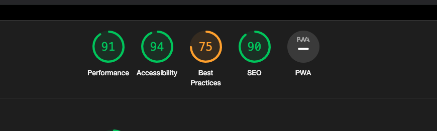
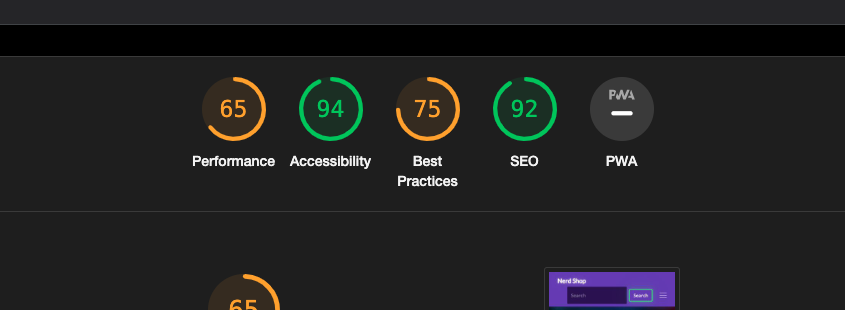
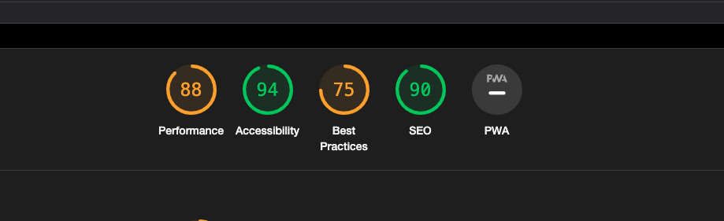
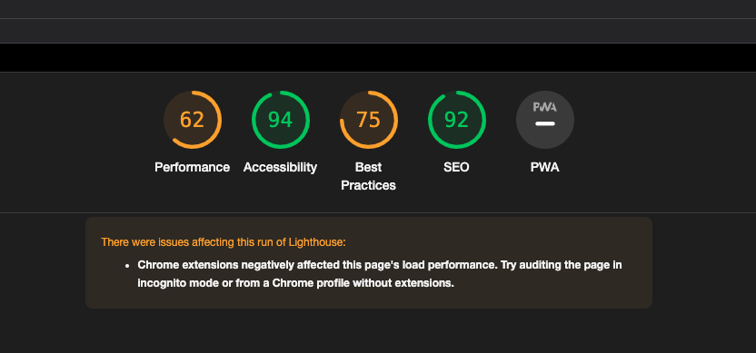
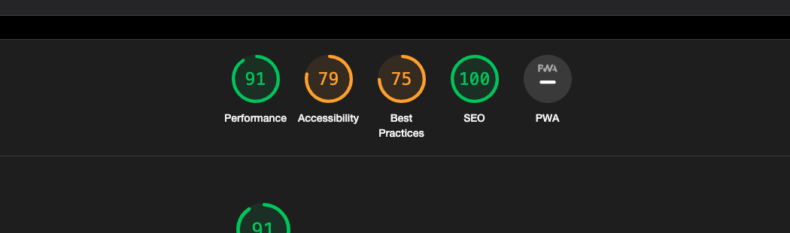
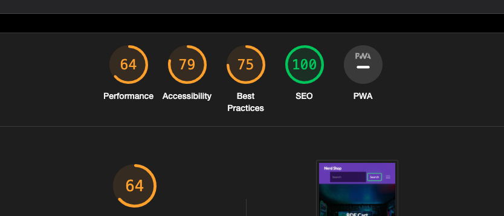
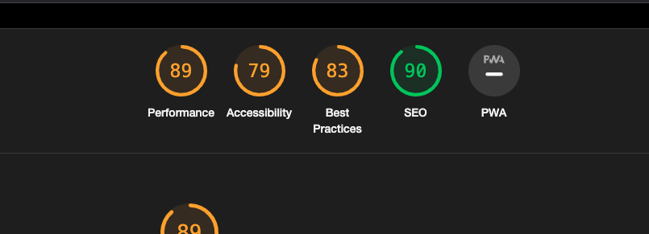
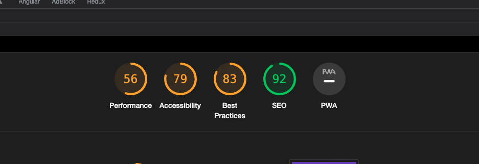

# Nerd Cave

[View published site on Heroku](https://nerd-cave.herokuapp.com/).


## Project Overview

Nerd Shop is an e-commerce store with products connected to video games consoles - games, controllers, accessories.
Nerd Shop is also a part of Nerd Cave blog which was part of my Code Institute Project-4. 
Huge reason between connecting those two projects is to point out how similar can be creating blog and e-commerce store in many aspects.

Whole CRUD operations are enabled due custom 'Admin Panel' available to users with staff member permission.
Permissions can be assigned by Admin through django admin page.
This site has been created as a portfolio project for Code Institute. Project - 5

## Table of Contents

1. [User Experience (UX)](#ux)
    * [Strategy](#strategy)
        * [Project Goals](#project-goals)
        * [User Stories](#user-stories)
    * [Scope](#scope)
    * [Design](#design)
    * [Skeleton](#skeleton)
        * [Wireframes](#wireframes)
        * [Database](#database)
2. [Features](#features)    
   * [Database Structure](#database-structure)
   * [Current Features](#current-features)
   * [Future Features](#future-features)
3. [Technologies Used](#tech-used)
4. [Testing](#testing)
    * [User Stories Testing](#user-testing)
    * [Validation Testing](#validation-testing)
    * [Lighthouse Testing](#lighthouse-testing)
5. [Deployment](#deployment)
6. [Credits](#credits)

## User Experience (UX) <a name="ux"></a>

## Strategy <a name="strategy"></a>

### Project Goals <a name="project-goals"></a>

The business goal for Nerd Shop is to sell consoles gaming industry oriented products. 
The user can create an account to be able to track orders history and assign default shipping address.
The user can smoothly move between blog Nerd Cave and a shop. If product in store was already reviewed on the blog, link to the review can be find on product details page below product description.


The main target customers/users are people interested in video games & consoles who are looking for games or accessories that some of them they might've heard about from blog review. Some examples of customers includes:

1. Blog viewers who finished reading article and are ready to make a purchase
2. Pro gamers looking for new controller. 
3. Casual gamers looking for new games
4. Parents looking for good gift for theirs kids
5. Potentially youtube NerdCave/NerdShop channel subscribers.

### User Stories <a name="user-stories"></a>

* __Site User Goals:__


  * As a User, I can see the newest arrivals in the store so that I can be up to date with new releases
  * As a User, I can browse products by categories so that I can find only things that I'm interested in
  * As a User, I can easily contact Administrator for more info so that I can get clarification if I have any doubts
  * As a User, I can search for a product by typing its name so that I can find exactly what I'm looking for.
  * As a User, I can filter by category and platform so that I can quickly find only products that's interesting me.
  * As a User, I can create my account so that I can save my delivery details, see order history.
  * As a User, I can see the 'about page' so that I can learn more about the people behind that website.
  * As a User, I can see detail page for each product so that I can learn more details about it and add it to the cart
  * As a User, I can send a message to site admins so that I can share my thoughts with the site owner(s) or send business offer to become an Admin of the shop
  * As a User, I can access shop policies ex. return policy so that I can feel confident about purchasing


* __Site Owner Goals:__

  * As a Site Admin, I have SQL database, AWS bucket and stripe account so that I can store my data in DB, store static files in AWS bucket and process payments from customers through Stripe
  * As a Site Admin, I can Add/Edit/Delete products through the custom admin panel.
  * As a Site Admin, I can assign staff members with permission whom I can delegate work on shop without giving them access to Django admin panel
  * As a Site Admin, I can get messages from users through 'Contact' form.
  * As a Site Admin, I have newsletter form which e-mail addresses I can use later as free marketing tool.


## Scope <a name="scope"></a>

To achieve the strategy goals, I implemented the following features:

* A navigation located at top of the page and also in the footer at the bottom of the page.
* A Home section which will allow the user to find out recent products from 3 main platforms (PS5,XBOX,SWITCH).
* A Contact page to provide users with possibility of contacting site admin.
* An About Us page to provide more information for visitor/customers.
* A policies page to comply with googles merchant requirements but also to keep customers and me safe.
* A SignUp page to allow new users to create an account.
* A SignIn page for existing users to access their account to allow them to save shipping details and allow them to track theirs order history.
* A Logout functionality.
* A Product List page to allowed user search through all products by platform/category/title that are in stock.
* A Product Detail page to view the selected product in more detail and allow adding it to cart or visit blog review if provided.
* A Footer at the bottom of the website which is a second navbar and also allows the user to access social media links.
* A fully responsive design that will work on different devices.
* An Error 404 Page to allow users to redirect back to Home page in case of any errors.
* An Error 500 Page to allow users to redirect back to Home page in case of any errors.
* Full CRUD functionality for Site Owner OR User promoted to Admin by Site Owner to allow to create, read, update and delete products.


## Design <a name="design"></a>

I have used bootstrap 5.2.3 for whole design. Custom CS was reduced to minimum to improve development time. 

To ensure a bit more custom experience than usual bootstrap websites provides I added custom bootstrap theme from [bootswatch.com](https://bootswatch.com/)

Main reason behind that was to create similar UX and UI that Nerd Cave has so **Site Owner** and **visitors** that are coming from the blog are familiar with the design.

## Skeleton <a name="skeleton"></a>

### Wireframes <a name="wireframes"></a>

**TODO: Add Images here**
Lots of wireframes are re-used from Nerd Cave to keep consistent design between both siblings projects. Both of them would be merged together in the future.
I've managed to stick to my original wireframes hand drawing.
Mobile wireframes are only for phone devices, for tablets I tried to keep the design as close to desktop as possible.

### Database Structure <a name="database-structure"></a>

A relational database was used for this project. 

During development was used PostgresSQL database hosted on [ElephantSQL](https://elephantsql.com/).


**TODO: Add image here**


The database diagram was created using [dbdiagram.io](https://dbdiagram.io/home).

The database contains the following similar models to ones in CI course examples plus one custom model - Contact.

* __Product__: Contains information about products submitted by admin, has a relationship with the User, Category, Platform models.
* __Platform__: Contains information about product related platform. Has relation with the Product model
* __Category__: Contains information about post console related category. Has relation with the Product model
* __Contact__: Contains information about form submitted by a site visitor, has no relationships with other models.
* __Newsletter__: Contains information about form submitted by a site visitor, has no relationships with other models.
* __Order__: Contains information about finalized purchase. Has relationship with User model.
* __OrderLineItem__: Contains information about products that were purchased. Has relationships with Product & Order models.
* __User__: This is a Django built-in model, has a relationship with the Post model & Comment model.


## Features <a name="features"></a>


### Current Features <a name="current-features"></a>

__Navigation__:

* This feature is present on all the pages/sections and is a part of 'base' html template.
* The navigation logo is located on the left side of navbar and hyperlinks are located on right side.
* Fully created with bootstrap components.
* Below Navigation is a 'Hero' header which is also part of 'base' template.

__Home__:

* This is the default page displayed when the user accesses the website.
* This page can also be viewed by clicking the Nerd Shop logo or the home button from the navigation.
* An introductory message displayed to the user.
* Home page displays latest 4 products from each platform.
* Each post is displayed in a card style with an image, title, category, price and CTA buttons.
* Clicking 'Read More' button will take the user to the Product Details page to display the full content of the post.
* Clicking 'Add Cart' button will add product to the cart straight from home view. Useful when customers came to shop straight looking for that product.

__About__:

* User can access this section by clicking the 'About' button from the navigation.
* User is able to learn more about people behind the website and it's purpose.
* User can find out connection between Nerd Shop and Nerd Cave blog website

__Product List__:
* Accessed by the navigation link.
* Displays list of 12 products per page
* Has a searchbar on right side on desktop and on top on mobile devices
* Searching can be made by post title,platform & category

__Sign Up__:
* Sign Up page is a part of django-allauth library used in the project.
* It's got customized by extending it's template with website base template plus few bootstrap classes.

__Sign In__:
* Sign In page is a part of django-allauth library used in the project.
* It's got customized by extending it's template with website base template plus few bootstrap classes.

__Logout__:
* Logout page is a part of django-allauth library used in the project.
* It's got customized by extending it's template with website base template plus few bootstrap classes.

__Footer__:
* Footer is a part of 'base' template and occurs on every page page
* Footer has navigation links to prevent user scrolling to top of the page to change page through top navbar
* Footer has social links to offer following easy following website and it's creator/s on social media's.

__Contact__:
* Contact page has a simple contact form which upon submitting can be accessed only by the website admin in django built-in admin panel

__404 Error Page__:
* Page can be seen only when trying to access pages that doesn't exist
* Template provides short explanation what's happened and provides a link to return to home page. 

__500 Error Page__:
* Page can be seen only when internal server error occur.
* Template provides short explanation what's happened and provides a link to return to home page. 

__Admin Panel__:
* Allows users with Admin permission (user is a staff member) to see a list of all products.
* Create new products
* Edit old products
* Delete unwanted products

__Admin Add Product__:
* Page can be reached by Author Panel
* Allows to create new products 
* Detailed product description is created with use of Summernote WYSIWYG web text editor, can easier stack more SEO friendly content.
* Admin is able to set status of product, assign category & platform, assign product image and set a title, provides short description that will be use in meta tags but also is seen next to product.
* Slug field is generated automatically
* Form allows putting products on sale

__Author Delete Post__:
* That page is only available through Author Panel.
* It's only a confirmation page
* Page is checking if current User is also an Author of that post which is about to be deleted.
* Upon deleting Author is redirected to Author Panel.

__Features Exclusive to Site Owner__:
* Built in Django panel at route /admin
__Features Exclusive to Admin__:
* Custom build Admin Panel allowing CRUD operation on products.

### Future Features <a name="future-features"></a>

Due lack of time I was unable to add advanced filtering options.

Merging Nerd Cave with Nerd Shop as a one project with same databases for better relationship between product and blog review

Images optimization!

Also I am planning to add in Author Panel upon clicking delete on a product instead of redirecting to separate page it would be
way better if upon clicking button bootstrap modal would popup with a confirmation and rest being handled by Javascript. 

Add more images that would suit my 'Hero' header. Ideally 1 image per page.

Remove JQuery from project. It's being used only in checkout page. Could be easily rewritten in vanilla JS.

## Technologies Used <a name="tech-used"></a>

* HTML
* CSS
* Python
* [Bootstrap v5.2.3](https://getbootstrap.com/): 
    * Bootstrap has been used for overall responsiveness of the website
* [Bootswatch](https://bootswatch.com/):
    * Custom theme for bootstrap offering more unique design experience.
* [Django](https://docs.djangoproject.com/en/3.1/): 
    * Django was used as the main framework to build this project.
* [AWS S3](https://aws.amazon.com/): 
    * Used for hosting static files and images.
* [dbdiagram](https://dbdiagram.io/):
    * Creating database design.
* [Unsplash](https://unsplash.com/):
    * Header and about page images.
* [Font Awesome](https://fontawesome.com/):
    * Icons used inside the project.
* [W3C Markup Validation Service](https://validator.w3.org/): 
    * The W3C Markup Validation was used to validate all of my HTML files.
* [W3C CSS Validation Service](https://jigsaw.w3.org/css-validator/): 
    * The W3C CSS Validation Service was used to validate my custom CSS files.
* [PEP8 Online Validation Service](http://pep8online.com/): 
    * The PEP8 Online Validation Service was used to validate the Python parts of that project.
* [Heroku](https://www.heroku.com/): 
    * Heroku has been used as a hosting provider with connection to Github repository.
* [Github](https://github.com/)
    * Github was used to create a repository which was connected to heroku.
* [HTMLWasher](https://www.htmlwasher.com/)
  * Content for posts was borrowed from other games oriented stores websites and re-written with new keywords.
  * They required cleaning of unnecessary html tags and css classes
* [PyCharm](https://www.jetbrains.com/pycharm/)
    * IDE used for that project.
    * Wanted to try different IDE than Gitpod or VS code.
* [JQuery](https://releases.jquery.com/)
    * Due lack of time it's being used only in checkout form.
    * To be replaced with vanilla JS solution in the future.


## Testing <a name="testing"></a>

Testing for this project was completed manually.

### User Stories Testing <a name="user-testing"></a>

User Stories Can be found [here](https://github.com/mich1991/NerdShop/issues?q=is%3Aissue+is%3Aclosed)
. Most of the User Stories has list of tasks attached to it in description.

Iteration for those User Stories can be found [here](https://github.com/mich1991/NerdShop/milestones)

GitHub project page can be found [here](https://github.com/users/mich1991/projects/6)

#### US-1. As a User I can see the newest arrivals in the store so that I can be up to date with new releases:
* First thing that user sees upon visiting website is a Hero header with a title 'New gen consoles goodies. All in one place'.
* Hero has arcade machines as background image giving a clue what the store is about.
* Simple navbar that has everything shop would need.
* Home page has separate section for each platform with the 4 newest products that arrived with images, price, category & CTA buttons
#### US-2. As a User I can browse all products so that I can find only things that I'm interested in:
* Products List page has a list of products that are paginating per 12 products
* Searchbar allows user to search products by the platform, category, title. 
#### US-3. As a User I can easily contact Administrator for more info so that I can get clarification if I have any doubts:
* Contact Page allows user to submit the contact form for easy and convenient way of reaching out to the Administrator.
#### US-4. As a User I can search for a product by typing its name so that I can find exactly what I'm looking for:
* Navbar includes searchbar to quickly search for a product.
* Since searchbar is included in navbar it can be reached from every page of the website.
#### US-5. As a User I can filter products by platforms, categories & title so that I can quickly find the best deal:
* Product List has a filters menu on sidebar allowing user to easily choose from available platforms and categories.
* If customer doesn't remember whole name of the product still can use searching by title and provides just a few letters and still may find the correct product customer was looking for.
#### US-6. As a User I can create my account so that I can save my delivery details, see order history:
* Sign Up and Sign In is clearly visible in navbar. As it's makes the most of sense they are last 2 items
in the navbar in mobile view and on desktop view they are just before 'cart' icon.
* Upon Sign Up username and password, email & email confirmation is required.
* Sign In is simple and upon login in user is redirected to home page.
* If user is signed in, navbar is getting changed. Sign Up/Sign In option are replaced with My Account route.
* My Account route allows to change shipping details, gives access to order history and also to logout.
* Also with correct permission users can get access to Admin Panel 
#### US-7. As a User I can see detail page for each product so that I can learn more details about it and add it to the cart:
* Each product has short description next to image and functionality to add more then 1 item to the bag in the same time.
* Each product has long description to provide more info about the product.
* Some product has links to its review on the Nerd Cave blog.
#### US-8. As a User I can access shop policies ex. return policy so that I can feel confident about purchasing:
* User can access Policies Page located in the footer.
* All Policies are located in one page saving time looking for specific policy that could be hidden in some nested navigation maze.
* Each policy is separated by a card border making it easier to navigate.
* Each policy is making it easier the read whole in one go.
#### US-9. As a User I can search products by brand, tag or etc so that I can find quicker products that interest me:
* Due lack of time that User Story is not implemented.
* Ideally it would allow sorting products by price, filtering by price range, brand , tags and etc. Also, product model would need to be changed for that.
#### US-10. As a User I can follow site on social media so that I could be up-to-date with the latest news:
* All social media links are included in footer in form of small icons representing each social platform.
* User can easily access each of those links on each page since they are always in footer.
#### US-11. As a User I can rate product so that I can share my opinion about product quality:
* Due lack of time that User Story is not implemented.
* Ideally it would allow rating products only for logged-in users that bought that product on Nerd Shop. That would be a safety measure from spamming negative ratings.
#### US-12. As a Site Admin, I have SQL database, AWS bucket and stripe account so that I can store my data in DB, store static files in AWS bucket and process payments from customers through Stripe:
* Database is PostgresSQL host on ElephantSQL platform
* AWS S3 buckets is storing all static files and are working correctly with both local and deployed versions.
* Stripe is configured with Django and allows getting responds both ways.
#### US-13. As a Site Owner I want to have a similar page layout and 'vibe' as my blog Nerd Cave so that visitors can quickly recognize that we are part of the same brand instantly improving our trustworthiness.:
* Both Nerd Shop and Nerd Cave are utilizing same bootstraps theme from bootswatch.com
* Layout is pretty similar and customer who comes from the blog will know instantly how to operate website
* Each customer without a doubt would connect that those to websites are owned by the same awesome owners.
* The similar 'vibe' is strong...
* Site Owner/Admin/Staff members who are working on the blog can work also on the shop without any previous platform training since both Admin Panels works similar
#### US-14. As a User I can add products to cart before heading to checkout so that I can purchase multiple products at once:
* Upon adding product to the cart user is returning to the page s/he originally was. User can keep adding products as much as s/he wants to.
* Bulk products adding is only available on product details screen.
* For quick adding product user is able to add product to the cart on Home & Product List page with simple clicking CTA 'Add Cart'
* In the Cart Page, Customer is allowed for 'last minute' changes. Customer can remove items or change it quantity in the cart.
* Customer can see total price for the cart and also delivery cost and the price that is a sum of delivery and total price of the cart.
#### US-15. As a User I can head to the checkout page so that I can finalize my shopping desires:
* User can access checkout page by going first to the cart page, then user has option to head to checkout page.
* Checkout Page provides standard checkout form and if user has account and provided shipping details they are automaticaly populated in the form fields. 
* Checkout Page also includes short order summary for customer convenience
* Upon submitting order you can still access that order in yours profile orders history.
#### US-16. As an Admin I want User to confirm emails upon registration so that I can avoid being spammed by fake accounts:
* During Sign Up to the page email address is required.
* After initial Sign Up email is being sent to confirm user authentic.
#### US-17. As a User I can sign up for the newsletter so that I can be up-to-date with any news:
* User can sign up to newsletter at Home Page at above the footer in a simple form.
#### US-18. As an Admin I can Add/Edit/Delete products through the custom admin panel or assign users with permission to do that so that I can delegate work on shop to someone else or modify store items without going into Django admin panel:
* Admin Panel can be accessed after Signing In to the website and with correct permission (staff member) through navigation. First link in the navbar.
* In Admin Panel Site Owner/Admin can search all products also those that are not published yet.
* In Admin Panel Site Owner/Admin can delete products
* In Admin Panel Site Owner/Admin can add new products
* In Admin Panel Site Owner/Admin can edit existing products
#### US-19. As a User I can quickly move from shop to blog and another way around so that I can learn more about products and stuff connected to products/topics interesting me:
* As a User I go to the Nerd Cave through navbar. Link to blog is located next to Contact Page link.
* Blog is being open in a new tab so user can have opened both Nerd Shop and Nerd Cave at the same time and jumping between those pages.
* Nerd Shop link was also added to previous project Nerd Cave to allow easy navigation between both websites. (Will be combined into one in the future)

##### All user stories except US-7 & US-11 which were abandoned due lack of time were implemented with satisfactory results


### Validation Testing <a name="validation-testing"></a>

#### 1. HTML - [W3C Markup Validation](https://validator.w3.org/)

1. Home Page

2. All Products

3. Product Details

4. About

5. Contact

6. Sign Out

7. Sign In

8. Sign Up

9. Admin Products list

10. Admin Add/Edit Product

11. Admin Delete Product

12. Policies

13. Cart

14. Checkout


#### 2. CSS - [W3C CSS Validation](https://jigsaw.w3.org/css-validator/)
1. app.css

2. index.css

3. checkout.css


#### 3. Python - PyCharm
PyCharm took care of quality of code and during development kept reminding me of PEP8 on submitting version
no issues where detected.

### Lighthouse Testing <a name="lighthouse-testing"></a>
1. About Page
    * Desktop
   
    * Mobile
   
2. All Products Page
    * Desktop
   
    * Mobile
   
3. Admin Delete Post
    * Desktop
   
    * Mobile
   
4. Admin Add/Edit Product (same view)
    * Desktop
   
    * Mobile
   
5. Admin Product List
    * Desktop
   
    * Mobile
   
6. Contact Page
    * Desktop
   
    * Mobile
   
7. Home Page
    * Desktop
   
    * Mobile
   
8. Sign In Page
    * Desktop
   
    * Mobile
   
9. Sign Out Page
    * Desktop
   
    * Mobile
   
10. Cart Page
    * Desktop
    
    * Mobile
    
11. Policies Page
    * Desktop
    
    * Mobile

12. Profile Page
    * Desktop
    
    * Mobile

13. Order History Page
    * Desktop
    
    * Mobile
    
14. Product Details Page
    * Desktop
   
    * Mobile
   


## Deployment <a name="deployment"></a>

The following steps were followed to deploy this project:
### AWS S3
1. Create free account at [AWS](https://aws.amazon.com/)
2. Credit card info will be required
3. Follow those [tutorial]('https://docs.aws.amazon.com/AmazonS3/latest/userguide/creating-bucket.html') and [documentation]('https://django-storages.readthedocs.io/en/latest/backends/amazon-S3.html')

### ElephantSQL
1. Create free account at [ElephantSQL](https://elephantsql.com)
2. Create New Instance of database. After it's done copy 'URL' whole path.


### Heroku - deployment
1. From the Heroku dashboard, select 'New' in the top right-hand corner.
2. Click 'Create new app'.
3. Enter the app name and choose region as Europe. 
4. Click 'Create app'.
5. Select the 'Settings' tab, and scroll down to 'Buildpacks'. 
6. Add 'Python' and save changes.
7. Scroll down to 'Config Vars' section, and add the 'KEY' and 'VALUE' for the each of env variables mentioned below in local deployment section.
8. SECRET_KEY can be any random string you want, 'sky-is-the-limit'
9. At the top of the page, click on the 'Deploy' section.
10. Select Github as deployment method.
11. Select 'Connect to Github', and locate the repository name and click on 'Connect' to link my Heroku app to my Github repository code.
12. Scroll further down, select 'Enable Automatic Deploys' and then select 'Deploy Branch'
to deploy project.
13. After it has successfully deployed a 'view' button appears on screen and when 
clicked opens the deployed application.

### Local deployment

1. Clone/Fork repo
2. Use ```pip3 install -r requirements.txt``` to install dependencies
3. Create file named '.env' add following lines to it 
    ```
    SECRET_KEY= YOUR SECRET KEY
    DATABASE_URL= YOUR SECRET KEY
    USE_AWS= True or False
    STRIPE_SECRET_KEY=YOUR STRIPE SECRET KEY
    STRIPE_PUBLIC_KEY=YOUR STRIPE PUBLIC KEY
    STRIPE_WH_SECRET=YOUR STRIPE WEBHOOK SECRET
    DEVELOPMENT=True or False
    AWS_ACCESS_KEY_ID=YOUR ACCESS KEY 
    AWS_SECRET_ACCESS_KEY=YOUR SECRET KEY
    EMAIL_HOST_USER=YOUR EMAIL
    EMAIL_HOST_PASS=YOUR EMAIL PASSWORD GENERATED BY GMAIL
    ```
4. After that project is ready to use.
5. ``` python3 manage.py migrate```
6. ``` python3 manage.py runserver```
7. Enjoy!
8. Don't forget about settings.py and DEBUG = True or False it's depends what's 
the purpose of deployment, for production DEBUG = False for Development and learning DEBUG = True


## Credits <a name="credits"></a>

Content used in that project comes from different sources. All of them are mentioned below.

```
products_used = https://www.gamestop.ie/
   
photos_used = [
    'https://unsplash.com/photos/EfQgEyzzsBM',
    'https://unsplash.com/photos/m3hn2Kn5Bns'
]
favicon = 'https://favicon.io/favicon-generator/'
```

## Acknowledgements <a name="acknowledgements"></a>
* I would like to thank my wife for supporting me all the time. 
* My mentor, Chris Quinn, for being of great support and providing valuable guidance and feedback throughout this process.